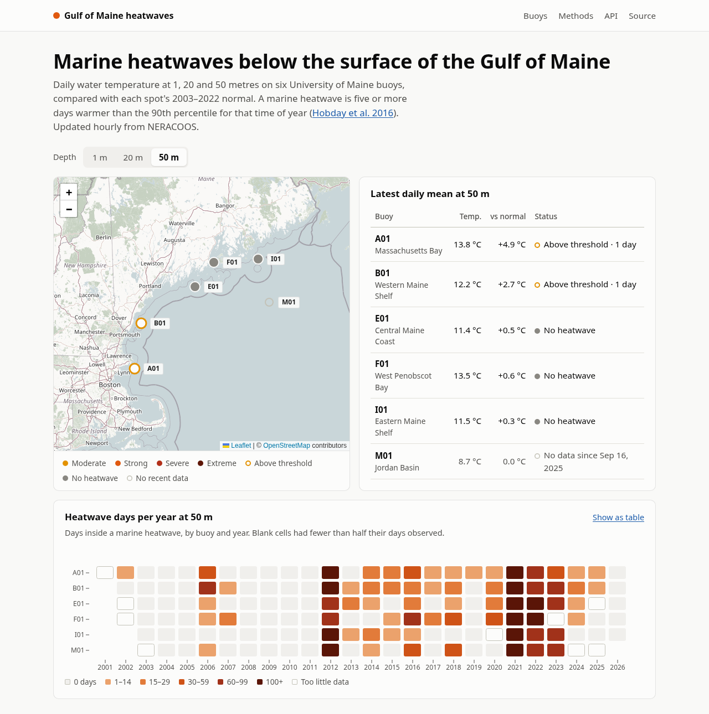

# Gulf of Maine heatwaves, below the surface

Live marine heatwave status at 1, 20 and 50 metres on six University of Maine
buoys in the Gulf of Maine, with the full record back to 2001. It reads
NERACOOS's ERDDAP server hourly, applies the standard marine heatwave
definition (Hobday et al. 2016) to each depth, and serves the result as a
small web app and a JSON API.

**Live site:** _coming soon_ · **API docs:** `/docs` on the live site



## Why

Most heatwave monitoring in the Gulf of Maine is based on satellite sea-surface
temperature, which only sees the top few millimetres; below that, reports lean
on ocean models. The UMaine/NERACOOS buoys have measured temperature directly
at fixed depths since 2001–2003, but nothing publicly applies the heatwave
definition to those records. This does, so you can see whether surface heat
reaches 20 and 50 m, and when heat at depth has no surface signal at all.

The record is striking. In 2021, the buoys' 20 m and 50 m sensors together
logged 1,046 and 1,033 heatwave days, against 566 at 1 m. The longest event in
the record ran 163 days at 20 m at F01 (West Penobscot Bay), from June to
November 2021. (Figures as of 2026-09-28.)


## How it works

```
NERACOOS ERDDAP ──NetCDF──▶ sync job ──▶ Postgres ──▶ FastAPI ──▶ browser
data.neracoos.org   hourly   xarray, pandas            JSON API   Leaflet map,
                                                       + pages    Observable Plot
```

- **Incremental sync.** Every row in these ERDDAP datasets carries a
  `time_modified` stamp. Each hour the sync job asks ERDDAP for the newest
  stamp and the span of days touched since its last visit (two tiny requests,
  reduced server-side with `orderByMax` and `orderByMinMax`), then downloads
  only those whole days as NetCDF. When UMaine replaces real-time data with
  post-recovery data, the reprocessed days come in the same way. The first run
  reads about 25 years for 18 series in under a minute.
- **Quality control and daily means.** Readings flagged bad by UMaine's own flag,
  or suspect/failed by the QARTOD aggregate flag, are dropped. The rest are
  averaged into hourly bins, then into UTC days; a day needs 18 hours of data.
- **Heatwave detection** ([`heatwaves/hobday.py`](heatwaves/hobday.py)) follows
  Hobday et al. (2016) and (2018): a seasonal normal and 90th-percentile threshold
  from an 11-day window pooled over 2003–2022 and smoothed over 31 days;
  events are five or more days above the threshold, joined across gaps of up to
  two days; categories run Moderate to Extreme.
- **Validated against the reference implementation.** On all 18 buoy/depth
  records, the detected events (688 of them, with their dates and categories)
  are identical to those from Eric Oliver's
  [marineHeatWaves](https://github.com/ecjoliver/marineHeatWaves), and the
  thresholds agree to within 0.005 °C. The comparison
  script is [`scripts/compare_with_reference.py`](scripts/compare_with_reference.py).
  (It caught one bug during development: the category comes from the day
  furthest above normal in multiples of the threshold's distance, not from the
  warmest day.)

### API

| Endpoint | Returns |
| --- | --- |
| `GET /api/buoys` | Every buoy with the latest conditions at each depth |
| `GET /api/buoys/{id}` | One buoy |
| `GET /api/buoys/{id}/{depth}/daily?start=&end=` | Daily mean, normal and threshold; gaps are `null` |
| `GET /api/events?buoy_id=&depth=&year=&min_category=` | Heatwaves, newest first |
| `GET /api/annual?depth=` | Heatwave days and observed days per buoy and year |
| `GET /healthz` | 200 while the sync job is current, 503 once it falls behind |

Interactive documentation (OpenAPI) is served at `/docs`.

## Running it

With Docker:

```sh
cp .env.example .env        # set POSTGRES_PASSWORD
docker compose up -d --build
```

Compose runs Postgres, a one-off `alembic upgrade head`, the web app on
<http://localhost:8000>, and the hourly sync job. Data appears after the first
sync, about a minute later.

Without Docker, using [uv](https://docs.astral.sh/uv/) and SQLite:

```sh
uv sync
uv run alembic upgrade head
uv run python -m heatwaves.sync           # add --every 3600 to keep going
uv run uvicorn heatwaves.main:app --reload
```

Tests use SQLite by default; set `TEST_DATABASE_URL` to run them against
Postgres, as CI does:

```sh
uv run pytest
uv run ruff check . && uv run ruff format --check .
uv run --with scipy scripts/compare_with_reference.py   # needs network
```

The sync tests replay real ERDDAP responses recorded in `tests/data`; the
climatology and event tests use synthetic series with known answers.

Configuration is by environment variable: `DATABASE_URL`, `ERDDAP_URL`,
`ERDDAP_TIMEOUT`, `ERDDAP_USER_AGENT` and `SYNC_STALE_AFTER_HOURS` (see
[`heatwaves/config.py`](heatwaves/config.py)). After changing the method, run
`python -m heatwaves.sync --recompute` to rebuild every series from stored data.

## Layout

```
heatwaves/
  hobday.py      heatwave science: daily means, climatology, events (no I/O)
  erddap.py      the few ERDDAP tabledap requests the app makes
  sync.py        incremental sync and recompute (python -m heatwaves.sync)
  models.py      SQLAlchemy tables; migrations/ holds the Alembic history
  api.py         JSON API
  pages.py       server-rendered pages; templates/ and static/ hold the front end
  stations.py    the buoys, depths and baseline tracked
scripts/         comparison with the reference implementation
tests/
```

## Decisions and limitations

- **A 20-year baseline.** Hobday et al. recommend 30 years; the buoy records
  begin in 2001–2003, so 2003–2022 is the longest period they all cover. The
  baseline is fixed rather than moving, so heatwaves become more frequent as
  the Gulf warms, which is the point.
- **Heat at depth isn't always new heat.** Autumn storms mix warm surface water
  down, pushing 50 m temperatures well above normal within a day or two. The
  Methods page says so; a heatwave there is still real for anything living at
  that depth.
- **Tables render on the server; charts are drawn in the browser.** Every number
  is readable without JavaScript, and every chart has a table view.
- **pandas for resampling.** xarray opens the NetCDF and computes the
  climatology, but resampling one long 1-D series is about 1,000× faster in pandas
  than in xarray without the optional `flox` package.
- **No accounts, admin or writes.** The site is read-only, which keeps the
  attack surface to a GET-only API.

Possible next steps: satellite comparison at each buoy (NOAA OISST via
THREDDS/OPeNDAP), marine cold spells, and refreshing on ERDDAP's subscription
or MQTT notifications instead of polling.

## Data and credits

Temperature data from buoys operated by the
[University of Maine Physical Oceanography Group](https://gyre.umeoce.maine.edu),
funded in part by NOAA through [NERACOOS](https://neracoos.org) and U.S. IOOS,
served by [NERACOOS ERDDAP](https://data.neracoos.org/erddap). The providers'
license: the data may be used and redistributed for free but are not intended
for legal use. Map tiles © [OpenStreetMap](https://www.openstreetmap.org/copyright)
contributors.

Hobday, A.J. et al. (2016). A hierarchical approach to defining marine
heatwaves. _Progress in Oceanography_ 141, 227–238.
[doi:10.1016/j.pocean.2015.12.014](https://doi.org/10.1016/j.pocean.2015.12.014)

Hobday, A.J. et al. (2018). Categorizing and naming marine heatwaves.
_Oceanography_ 31(2). [doi:10.5670/oceanog.2018.205](https://doi.org/10.5670/oceanog.2018.205)

This is an independent portfolio project, not affiliated with NERACOOS, GMRI or
the University of Maine. Code is MIT licensed.
