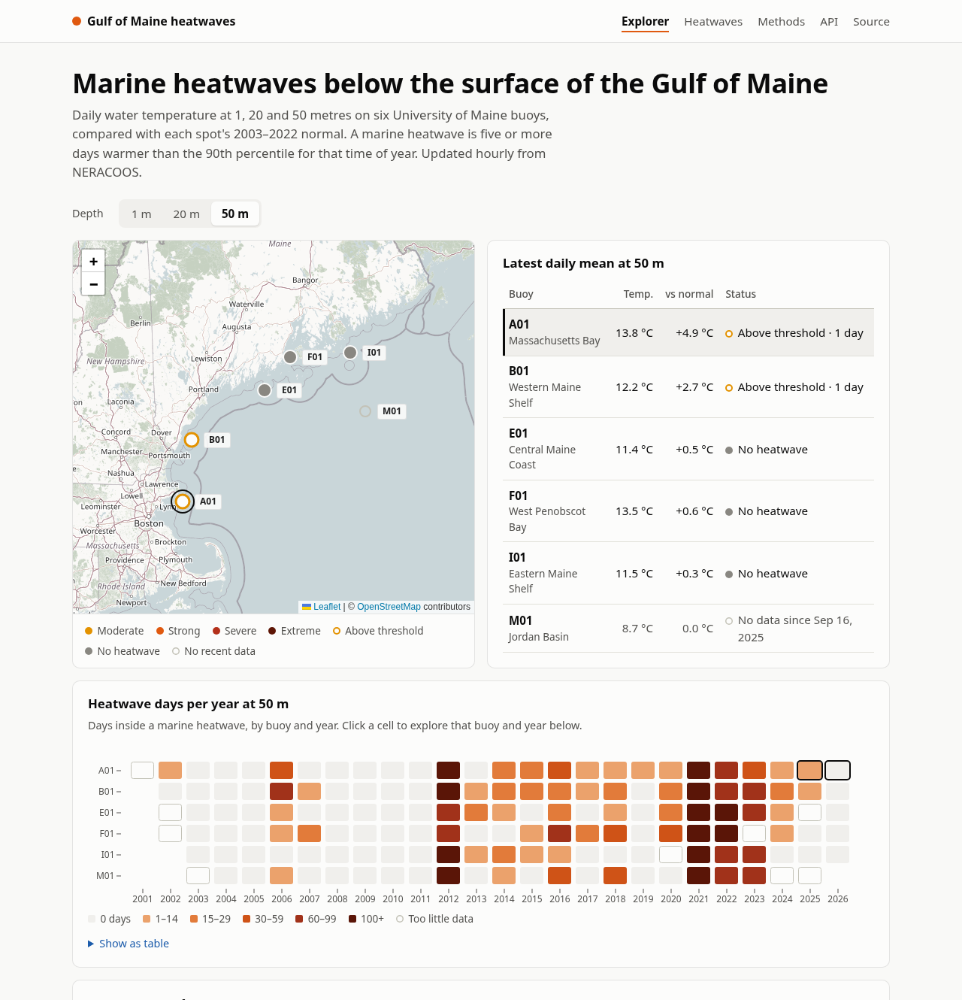
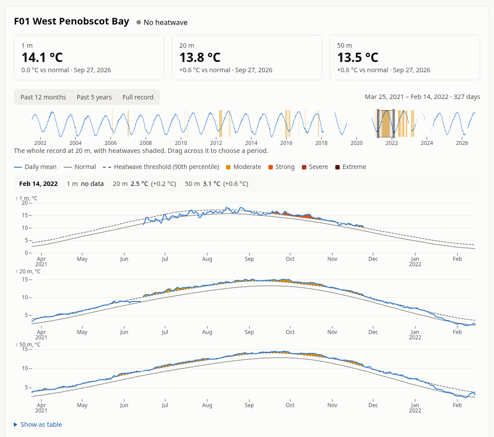

# Gulf of Maine heatwaves, below the surface

Live marine heatwave status at 1, 20 and 50 metres on six University of Maine
buoys in the Gulf of Maine, with the full record back to 2001, set beside the
satellite record at each buoy. A Python job reads NERACOOS's ERDDAP server (and
NOAA's, for the satellite) hourly and applies the standard marine heatwave
definition (Hobday et al. 2016) to each depth; a FastAPI JSON API serves the
results to a React app for exploring them.

**Live site:** _coming soon_ · **API docs:** `/docs` on the live site



## Why

Most heatwave monitoring in the Gulf of Maine is based on satellite sea-surface
temperature, which only sees the top few millimetres; below that, reports lean
on ocean models. The UMaine/NERACOOS buoys have measured temperature directly
at fixed depths since 2001–2003, but nothing publicly applies the heatwave
definition to those records. This does, so you can see whether surface heat
reaches 20 and 50 m, and when heat at depth has no surface signal at all.

Each buoy is also compared with NOAA's OISST, the satellite record behind
GMRI's Gulf of Maine temperature reports, in the nearest grid cell. On 68% of
the days the buoys logged a heatwave at 50 m, the satellite showed none at the
surface above. At 1 m, where the two measure nearly the same water, that share
is 35%, so the gap at depth is about twice what two surface records alone
produce.

The record is striking. In 2021, the buoys' 20 m and 50 m sensors together
logged 1,046 and 1,033 heatwave days, against 566 at 1 m. The longest event in
the record ran 163 days at 20 m at F01 (West Penobscot Bay), from June to
November 2021. (Figures as of 2026-09-28.)



## How it works

```
NERACOOS ERDDAP ──NetCDF──▶ sync job ──▶ Postgres ──▶ FastAPI ──▶ Caddy ──▶ React app
data.neracoos.org   hourly   xarray, pandas            JSON API    serves the   Leaflet, Observable Plot,
(buoys, tabledap)      ▲                                           app, proxies TanStack Query
                       │                                           /api
CoastWatch ERDDAP ─────┘
(OISST, griddap)
```

- **Incremental sync** ([`heatwaves/sources.py`](heatwaves/sources.py)).
  Every row in these ERDDAP datasets carries a `time_modified` stamp. Each
  hour the sync job asks ERDDAP for the newest stamp and the span of days
  touched since its last visit (two tiny requests, reduced server-side with
  `orderByMax` and `orderByMinMax`), then downloads only those whole days as
  NetCDF. When UMaine replaces real-time data with post-recovery data, the
  reprocessed days come in the same way. The first run reads about 25 years
  for 18 series in under a minute.
- **Satellite sea surface temperature** (`GriddapSource` in the same file).
  NOAA OISST v2.1 from CoastWatch's ERDDAP, in the nearest quarter-degree cell
  with data to each buoy (OISST masks coastal cells as land). One request
  reads all six cells as a small box, so the first run backfills 2001 onwards
  in about 26 yearly requests, three minutes. After that, one tiny request an
  hour asks for the newest day; each new day re-reads the past 30 from the
  final product where it exists and the preliminary one after, so final values
  replace preliminary ones. Satellite heatwaves use the same method and
  2003–2022 baseline as the buoys.
- **Quality control and daily means** ([`heatwaves/qc.py`](heatwaves/qc.py)).
  Readings flagged bad by UMaine's own flag, or suspect/failed by the QARTOD
  aggregate flag, are dropped. The rest are averaged into hourly bins, then
  into UTC days; a day needs 18 hours of data.
- **Heatwave detection** ([`heatwaves/hobday.py`](heatwaves/hobday.py)) follows
  Hobday et al. (2016) and (2018): a seasonal normal and 90th-percentile threshold
  from an 11-day window pooled over 2003–2022 and smoothed over 31 days;
  events are five or more days above the threshold, joined across gaps of up to
  two days; categories run Moderate to Extreme.
- **Validated against the reference implementation.** On all 18 buoy/depth
  records, the detected events (688 of them, with their dates and categories)
  are identical to those from Eric Oliver's
  [marineHeatWaves](https://github.com/ecjoliver/marineHeatWaves), and the
  thresholds agree to within 0.005 °C. The comparison
  script is [`scripts/compare_with_reference.py`](scripts/compare_with_reference.py).
  (It caught one bug during development: the category comes from the day
  furthest above normal in multiples of the threshold's distance, not from the
  warmest day.)

### Frontend

A React 19 + TypeScript single-page app in [`frontend/`](frontend), built with
Vite. Everything on screen is linked:

- **Linked views.** Clicking a buoy on the map or in the conditions table, or a
  cell in the heatwave-days heatmap (say F01 · 2021), updates the detail panel in
  place. The view lives in the URL (`/?buoy=F01&depth=20&from=2021-05-01&to=2021-12-31`),
  so any view can be bookmarked or shared and the back button works.
- **Zoomable time range.** A strip showing a buoy's whole record, with heatwaves
  shaded, sits above the detailed charts; drag across it to pick any period.
  Presets and heatmap clicks move the brush too.
- **Synchronized hover.** One chart per depth shares a time axis; hovering any of
  them moves a crosshair across all three and reads out every depth's
  temperature, anomaly and heatwave status for that day.
- **Satellite comparison.** The 1 m chart carries the satellite's sea surface
  temperature as a dashed line, and a "What the satellite misses" chart splits
  each year's heatwave days at 20 and 50 m into days the satellite also saw a
  heatwave and days it saw none. The explorer leads with the share for 50 m,
  beside the same share at 1 m as a yardstick.
- **Heatwaves explorer** (`/events`). All ~690 events, filterable by buoy, depth,
  year and category and sortable by date, length, intensity or category, with
  the filters in the URL. Each row opens the explorer zoomed to that event.

TanStack Query caches API responses, and a period that is still loading keeps
the previous charts on screen, dimmed. Charts use Observable Plot inside one
small React frame that handles width, loading, errors and the table view; the
brush is d3-brush on top of a Plot chart. Every chart has a table view. Data
colours come from two ordinal ramps checked for lightness order, hue spread and
contrast, and the satellite's colours were checked the same way against the
ones beside them.

### API

| Endpoint | Returns |
| --- | --- |
| `GET /api/buoys` | Every buoy with the latest conditions at each depth, and the satellite's with its grid cell |
| `GET /api/buoys/{id}` | One buoy |
| `GET /api/buoys/{id}/{depth}/daily?start=&end=` | Daily mean, normal and threshold; gaps are `null`; depth 0 is the satellite |
| `GET /api/events?buoy_id=&depth=&year=&min_category=` | Heatwaves at the buoys, newest first |
| `GET /api/annual?depth=` | Heatwave days and observed days per buoy and year |
| `GET /api/agreement?depth=` | Days per buoy and year with a heatwave at depth, at the surface by satellite, both or neither |
| `GET /healthz` | 200 while the sync job is current, 503 once it falls behind |

Interactive documentation (OpenAPI) is served at `/docs`.

## Running it

With Docker:

```sh
cp .env.example .env        # set POSTGRES_PASSWORD
docker compose up -d --build
```

Compose runs Postgres, a one-off `alembic upgrade head`, the API, the hourly
sync job, and the frontend: Caddy serving the built app on
<http://localhost:8000> and forwarding `/api`, `/docs` and `/healthz` to the
API, so the browser sees a single origin. Buoy data appears after the first
sync, about a minute later, and the satellite's a few minutes after that.

For development, run the backend with [uv](https://docs.astral.sh/uv/) and
SQLite, and the frontend with Vite, which forwards API requests to uvicorn:

```sh
uv sync
uv run alembic upgrade head
uv run python -m heatwaves.sync           # add --every 3600 to keep going
uv run uvicorn heatwaves.main:app --reload

cd frontend && npm install && npm run dev  # http://localhost:5173
```

Checks, as CI runs them:

```sh
uv run pytest --cov      # fails under 90% coverage; SQLite unless TEST_DATABASE_URL is set
uv run ruff check . && uv run ruff format --check .
uv run ty check
cd frontend && npm run lint && npm test && npm run build   # build includes the type check
uv run --with scipy scripts/compare_with_reference.py      # needs network
```

The sync tests replay real ERDDAP responses recorded in `tests/data` (listed
by URL pattern in `tests/conftest.py`); the climatology and event tests use
synthetic series with known answers.

Configuration is by environment variable: `DATABASE_URL`, `ERDDAP_URL`,
`COASTWATCH_URL`, `ERDDAP_TIMEOUT`, `ERDDAP_USER_AGENT` and
`SYNC_STALE_AFTER_HOURS` (see
[`heatwaves/config.py`](heatwaves/config.py)). After changing the method, run
`python -m heatwaves.sync --recompute` to rebuild every series from stored data.

## Layout

```
heatwaves/
  hobday.py      heatwave science: climatology, events, status (no I/O)
  qc.py          quality flags and daily means, for any variable (no I/O)
  compare.py     buoy against satellite heatwave days (no I/O)
  erddap.py      the few ERDDAP tabledap and griddap requests the app makes
  sources.py     what changed at each data source since the last sync
  sync.py        store, recompute, and the sync job (python -m heatwaves.sync)
  queries.py     reads of the stored record shared by the API and reports
  models.py      SQLAlchemy tables; migrations/ holds the Alembic history
  api.py         JSON API; main.py wires up the FastAPI app
  stations.py    the series tracked (buoy, depth, variable, source) and baseline
frontend/src/
  pages/         explorer, heatwaves list, methods
  components/    map, heatmap, range brush, depth charts, tables
  api/           typed API client and TanStack Query hooks
  state/         explorer view <-> URL
  lib/           dates, formatting, colours, event filtering
scripts/         comparison with the reference implementation
tests/           backend tests; frontend tests sit beside their code
```

## Decisions and limitations

- **A 20-year baseline.** Hobday et al. recommend 30 years; the buoy records
  begin in 2001–2003, so 2003–2022 is the longest period they all cover. The
  baseline is fixed rather than moving, so heatwaves become more frequent as
  the Gulf warms, which is the point.
- **Heat at depth isn't always new heat.** Autumn storms mix warm surface water
  down, pushing 50 m temperatures well above normal within a day or two. The
  Methods page says so; a heatwave there is still real for anything living at
  that depth.
- **A separate frontend, one origin.** The API serves only JSON; the React app is
  static files behind Caddy, which proxies `/api`. No CORS configuration, and
  the two can be deployed and scaled independently. The trade-off is that the
  site needs JavaScript; the API remains usable on its own.
- **pandas for resampling.** xarray opens the NetCDF and computes the
  climatology, but resampling one long 1-D series is about 1,000× faster in pandas
  than in xarray without the optional `flox` package.
- **No accounts, admin or writes.** The site is read-only, which keeps the
  attack surface to a GET-only API.

Possible next steps: marine cold spells, and refreshing on ERDDAP's MQTT
change notifications instead of polling.

## Data and credits

Temperature data from buoys operated by the
[University of Maine Physical Oceanography Group](https://gyre.umeoce.maine.edu),
funded in part by NOAA through [NERACOOS](https://neracoos.org) and U.S. IOOS,
served by [NERACOOS ERDDAP](https://data.neracoos.org/erddap). The providers'
license: the data may be used and redistributed for free but are not intended
for legal use. Satellite sea surface temperature is NOAA's
[OISST v2.1](https://www.ncei.noaa.gov/products/optimum-interpolation-sst),
served by [NOAA CoastWatch ERDDAP](https://coastwatch.pfeg.noaa.gov/erddap).
Map tiles © [OpenStreetMap](https://www.openstreetmap.org/copyright)
contributors.

Hobday, A.J. et al. (2016). A hierarchical approach to defining marine
heatwaves. _Progress in Oceanography_ 141, 227–238.
[doi:10.1016/j.pocean.2015.12.014](https://doi.org/10.1016/j.pocean.2015.12.014)

Hobday, A.J. et al. (2018). Categorizing and naming marine heatwaves.
_Oceanography_ 31(2). [doi:10.5670/oceanog.2018.205](https://doi.org/10.5670/oceanog.2018.205)

Huang, B. et al. (2021). Improvements of the Daily Optimum Interpolation Sea
Surface Temperature (DOISST) Version 2.1. _Journal of Climate_ 34, 2923–2939.
[doi:10.1175/JCLI-D-20-0166.1](https://doi.org/10.1175/JCLI-D-20-0166.1)

This is an independent portfolio project, not affiliated with NERACOOS, GMRI or
the University of Maine. Code is MIT licensed.
