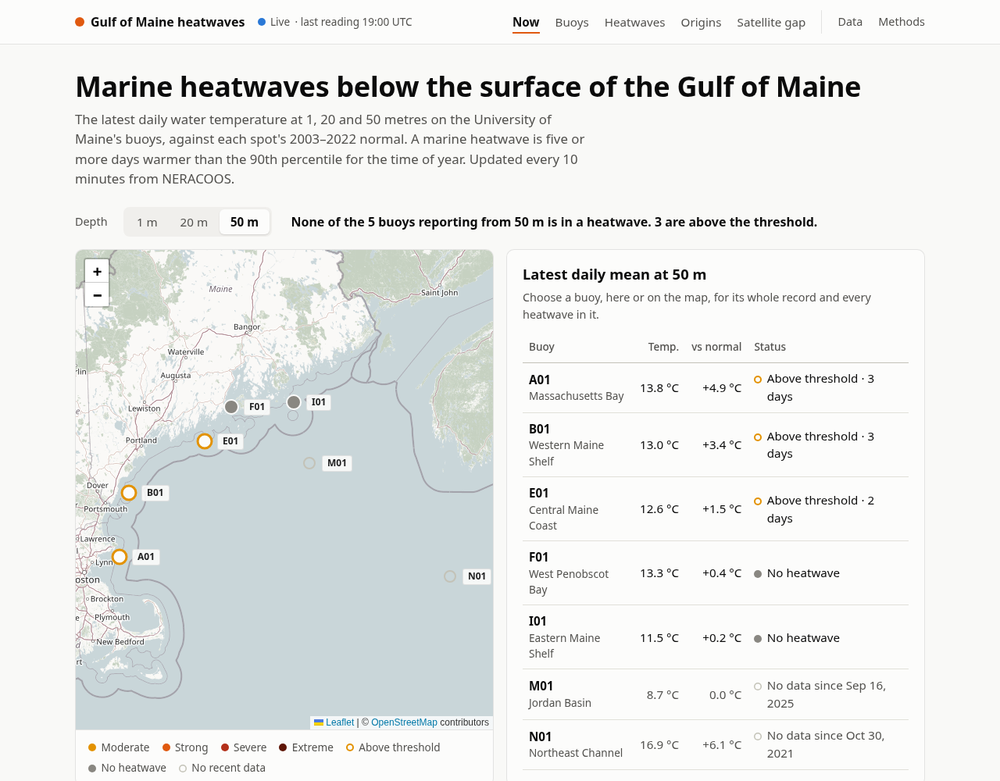
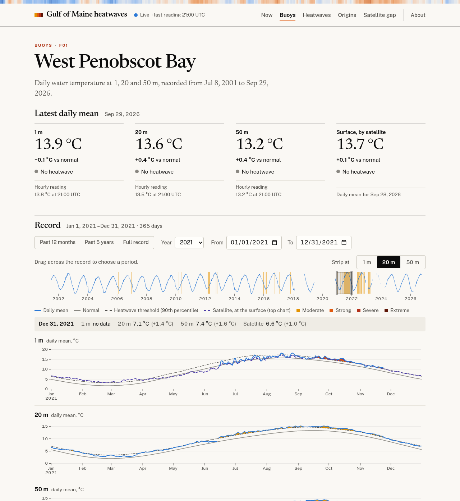

# Gulf of Maine heatwaves, below the surface

Marine heatwaves at fixed depths on seven University of Maine buoys in the
Gulf of Maine, over records that go back as far as 2001: at 1, 20 and 50
meters on each, and at 100 to 250 m in Jordan Basin (M01). The five still
reporting are followed live; M01 and N01 are retired. Each buoy but N01 is
set beside the satellite record in the nearest grid cell, and every heatwave
at 20 and 50 m gets a rule-of-thumb label for where its heat may have come
from. A Python job reads NERACOOS's ERDDAP server every 10 minutes (and
NOAA's, for the satellite, every hour) and applies the standard marine
heatwave definition (Hobday et al. 2016) to each depth; a FastAPI JSON API
serves the results to a React app for exploring them, and pushes new
readings to it over a WebSocket as they're stored. The whole record is also
published as CF NetCDF and CSV files, ready for ERDDAP.

**Live site:** <https://gulfofmaine.maxretter.com> · **API docs:** <https://gulfofmaine.maxretter.com/docs>



## Why

The University of Maine's buoys have measured temperature at fixed depths
since as early as 2001. This applies the standard marine heatwave definition
to every depth, so heatwaves at 20 and 50 m can be seen beside those at the
surface.

Each buoy but N01 is also compared with NOAA's OISST satellite record of sea
surface temperature, in the nearest grid cell with data. At 1 m, those six
buoys' daily temperatures follow the satellite's closely: pooled, they
correlate at 0.99, mostly through the seasons they share, and their anomalies
from each series' own normal at 0.89. On 68% of the days the six logged a
heatwave at 50 m, the satellite showed none at the surface; at 1 m, the share
is 35%. Each share pools that depth's heatwave days from every buoy, so the
two rest on different days and a different mix of buoys, and aren't a
like-for-like comparison.

Each heatwave at 20 and 50 m also gets a label from five signals: Offshore when
they point to warm water arriving at depth, Surface when they point to heat
from the surface reaching down, Unclear when they don't agree. These are this
project's own rules of thumb, not a published or tested method. Of the 77
heatwaves at 20 and 50 m that began in 2021, 44 are labeled offshore and 2
surface; of the 85 that began in 2012, 17 offshore and 30 surface. Across the
whole record about half are Unclear, and the site says so.

Heatwaves that began in 2021 lasted 1,076 days in all at 20 m and 1,033 at
50 m, summed over the buoys, against 571 at 1 m. The three longest in the
record ran 165 and 164 days at 150 and 200 m in Jordan Basin (M01), from
January to June 2023, and 163 days at 20 m at F01 (West Penobscot Bay), from
June to November 2021.
(Figures as of 2026-10-01, from `scripts/readme_figures.py` and
`scripts/satellite_correlation.py`.)



## How it works

```
NERACOOS ERDDAP ──NetCDF──▶ sync job ──▶ Postgres ─NOTIFY─▶ FastAPI ──▶ Caddy ─────▶ React app
data.neracoos.org   10 min  xarray, pandas                  JSON API,   serves the   Leaflet, Observable Plot,
(buoys, tabledap)      ▲       │                            WebSocket,  app, proxies TanStack Query
                       │       │                            downloads   /api, /erddap
CoastWatch ERDDAP ─────┘       ▼                               ▲          │
(OISST, griddap)        CF NetCDF + CSV ───────────────────────┴────────▶ ERDDAP (optional)
                        products volume                                   EDDTableFromNcCFFiles
```

- **Incremental sync** ([`heatwaves/sources.py`](heatwaves/sources.py)).
  Every row in these ERDDAP datasets carries a `time_modified` stamp. Every
  10 minutes the sync job asks ERDDAP for each reporting buoy dataset's newest
  stamp (one tiny request, reduced server-side with `orderByMax`); when there
  is a new one, it asks for the span of days touched since its last visit
  (`orderByMinMax`) and downloads only those whole days as NetCDF, every
  variable of a dataset in one request. The 15 datasets still reporting make
  about 90 requests an hour when nothing has changed. Once an hour it checks
  everything else too: the satellite, and the retired buoys, whose data only
  changes when it's reprocessed. Rows revised at the source come in the same
  way, as long as their `time_modified` stamp changes. Rows can reach ERDDAP
  after rows stamped later, so the span also takes in the rows stamped and
  observed in the two days before the newest stamp already read. By design,
  the sync misses rows deleted at the source when nothing else in their days
  is stamped (those days stay as stored), a late row stamped or observed
  before those two days, and late rows from a buoy that then stamps nothing
  new, since a round stops after one request while the newest stamp is
  unchanged.
- **Live updates** ([`heatwaves/live.py`](heatwaves/live.py)). The sync
  sends a Postgres `NOTIFY` with each new reading, each change of heatwave
  state, and the heatwaves whose origin label or its evidence changed, in the
  transaction that stores them, so nothing is announced before it's
  committed. The API holds one `LISTEN` connection and relays each message to
  browsers over a WebSocket at `/api/live`; no Redis or message queue. Every
  API response carries an ETag and `Cache-Control: no-cache`, so a refetch
  prompted by a message is never answered from a stale cache, and an
  unchanged one costs a 304. A Postgres advisory lock keeps a one-off sync
  from storing at the same time as the scheduled job.
- **Satellite sea surface temperature** (`GriddapSource` in the same file).
  NOAA OISST v2.1 from CoastWatch's ERDDAP, in the nearest quarter-degree cell
  with data to each buoy (a buoy's own cell can be empty near the coast). One
  request reads all six cells as a small box, so the first run backfills 2001
  onwards in about 26 yearly requests. After that, one tiny request an
  hour asks for the newest day; each new day re-reads the past 30, or back to
  the oldest day still preliminary if the final product has fallen further
  behind, from the final product where it exists and the preliminary one
  after, so final values replace preliminary ones. Satellite heatwaves use
  the same method and 2003–2022 baseline years as the buoys, with each cell's
  own normal.
- **Quality control and daily means** ([`heatwaves/qc.py`](heatwaves/qc.py)).
  Readings that UMaine's own flag doesn't mark good are dropped, and so are
  any the QARTOD aggregate flag marks suspect or failed. In every dataset read
  here, as of 2026-10-01, neither flag drops a reading: every row with a value
  is marked good by both, and the rows either flag marks have none
  ([`scripts/qc_flags.py`](scripts/qc_flags.py) lists each dataset's flag
  pairs). The readings are averaged into hourly bins, then into UTC days; a
  day needs 18 hours of data.
- **Heatwave detection** ([`heatwaves/hobday.py`](heatwaves/hobday.py)) follows
  Hobday et al. (2016) and (2018): a seasonal normal and 90th-percentile threshold
  from an 11-day window pooled over 2003–2022 and smoothed over 31 days;
  events are five or more days above the threshold, joined across gaps of up to
  two days; categories run Moderate to Extreme. Up to two missing days in a
  row are filled in by interpolation; a longer gap in the data ends a
  heatwave, and the days either side are heatwaves only if each part lasts
  five days.
- **Origin labels** ([`heatwaves/origin.py`](heatwaves/origin.py)). Five
  signals, read around a heatwave's onset, each vote offshore, surface, or not
  at all: the salinity anomaly at its depth; a heatwave at 1 m beforehand;
  whether the 1 m minus depth temperature difference holds or falls below
  half, whichever end moves; whether M01 at 100–250 m was in a heatwave in
  the 30 days before onset; and whether a heatwave began at N01 or M01 more
  than 7 days before one at A01 or B01, in the 90 days up to and including
  the onset, leaving out the heatwave's own buoy: one at A01 is compared with
  B01 alone on the western side. So its own onset never counts, one at any of
  the four with no onset at the other three doesn't vote, and an onset on one
  side alone votes only if the other side has data. A label needs two more
  votes than the other side, else Unclear. These are rules of thumb
  written for this project, not a published or tested method. They are pure
  functions, unit-tested on synthetic series, and their thresholds are served
  at `/api/origin/rules` so the About page can't drift from the code. Why each
  signal voted as it did, or didn't, is read from the evidence by the same
  module and served with the heatwave, so the heatwave's page only puts it in
  words. Labels and their evidence are stored on each event, and judged again
  whenever the days they rest on change, at any of the buoys and depths they
  read.
- **The results as data** ([`heatwaves/products.py`](heatwaves/products.py)).
  One NetCDF file per buoy and depth (the daily temperature, normal,
  threshold, anomaly and heatwave category, each heatwave's origin, salinity,
  and the satellite's record at each buoy but N01) and an events table, each
  also as CSV. After a sync round that stores new data, the job rewrites the
  files of each buoy and depth whose data changed, and the events table. They
  follow the CF conventions 1.11 as discrete sampling geometries, one time
  series per file, with ACDD 1.3 metadata, and are built from the same reads
  as the JSON API. The daily CSV gives each value to the API's 0.001, the
  NetCDF every digit stored; tests check that a download, rounded to 0.001,
  matches the API exactly, and run the IOOS compliance checker's CF and ACDD
  checks on sample files.
  [`erddap/datasets.xml`](erddap/datasets.xml), drafted by ERDDAP's
  `GenerateDatasetsXml`, serves them from ERDDAP as two datasets. Opening one
  takes three lines:

  ```python
  import xarray as xr

  ds = xr.open_dataset("http://localhost:8000/api/data/A01/50.nc#mode=bytes")
  ds.temperature_anomaly.sel(time="2021").plot()
  ```
- **Validated against the reference implementation.** On all 25 buoy/depth
  temperature records, the detected events (856 of them, with their dates and
  categories) are identical to those from Eric Oliver's
  [marineHeatWaves](https://github.com/ecjoliver/marineHeatWaves), run with
  the same two-day limit on filling gaps (by default it fills none, so there
  a single missing day breaks a heatwave), and
  the thresholds agree to within 0.005 °C (last run 2026-09-29). The comparison
  script is [`scripts/compare_with_reference.py`](scripts/compare_with_reference.py);
  it needs network access and isn't part of CI.

### Frontend

A React 19 + TypeScript single-page app in [`frontend/`](frontend), built with
Vite. It goes from the whole Gulf to one buoy to one heatwave, and each view
lives in the URL, so any view can be bookmarked or shared and the back button
works:

- **Now** (`/?depth=50`). Every buoy's latest daily mean at one depth, on a map
  and in a table, with a line saying how many are in a heatwave and, counted
  apart, how many more have one paused, which may go on or may turn out to
  have ended. Each buoy leads to its own page. Above them, the whole record at
  50 m as warming stripes, a month to a stripe; hover one for its month.
- **Buoys** (`/buoys`). Every buoy, retired ones included: its depths, the span
  of its record, how many heatwaves it has logged and whether it's in one now,
  or one is paused.
- **A page per buoy** (`/buoys/F01?depth=20&from=2021-05-01&to=2021-12-31`).
  Its latest readings and status at each depth, and its record: a strip of the
  whole record at one depth, with heatwaves shaded, sits above the detailed
  charts; drag across it to pick any period, or choose one with the presets, a
  year, or from and to dates. The heatwave list moves the brush too. Links into the single-page explorer this replaced
  (`/?buoy=F01&…`) redirect here.
- **Synchronized hover.** One chart per depth shares a time axis; hovering any of
  them moves a crosshair across all of them and reads out every depth's
  temperature, anomaly and heatwave status for that day.
- **What the satellite misses** (`/satellite`). The share of heatwave days at
  50 and 20 m with no satellite heatwave at the surface above, beside the same
  share at 1 m as a yardstick; each year's heatwave days at depth split into
  days the satellite also saw a heatwave and days it saw none; and the shares at
  each buoy. Each buoy's page has its own split, and its 1 m chart carries the
  satellite's sea surface temperature as a dashed line.
- **Heatwaves** (`/events`). Heatwave days per buoy and year as a heatmap, over
  all ~860 events, filterable by buoy, depth, year, category and origin and
  sortable by date, length, intensity or category, with the filters in the URL.
  A heatmap cell filters the list to its buoy and year; each row opens that
  heatwave's page.
- **A page per heatwave** (`/events/A01/50/2021-04-14`, addressed as the API
  addresses it). Its length, peak and mean, each ranked among the buoy's other
  heatwaves at that depth (so far, for one ongoing or paused), and what its
  category means; the temperature through it at every depth; and every
  heatwave that overlapped it, at the buoy's other depths and at the other
  buoys. At 20 and 50 m, its origin, with each of the five signals as a small
  chart over the onset window, its vote and a sentence on what it measured,
  and a temperature–salinity diagram of the water before and after the onset.
- **Live.** The page keeps a WebSocket open to `/api/live` and writes each
  new reading into TanStack Query's cache, so the tiles show the latest
  reading and the map marker pulses as it arrives. A reading refetches what
  the day's mean feeds (the conditions, that buoy depth's days, and the
  stripes, the year's anomalies and the days observed at its depth), a status
  change what depends on heatwaves as well, and a changed origin what shows
  that heatwave's origin. The refetches are gathered for three seconds, so
  that a sync round's messages refetch each query once. A buoy depth entering
  a heatwave gets a notice, but not one whose paused heatwave goes on. The
  header says whether the feed is connected. The connection reconnects with
  backoff, drops itself if the server's 30-second pings stop, and refetches
  everything on screen each time it connects, the first time too, to cover
  what it missed.
- **About** (`/about`). How heatwaves are found, the origin rules signal by
  signal, the data and the satellite comparison, and the API and files, with
  every file listed. The old `/methods` and `/data` pages redirect to their
  sections.
- **Offshore or surface?** (`/origins`). Heatwaves at 20 or 50 m by the year
  each began, stacked by origin label with Unclear kept in view; click a year
  to see it below: every buoy's year from east to west, with each heatwave
  that overlaps it a bar colored by its label under a strip of the daily
  anomaly. A heatwave opens its page.

TanStack Query caches API responses, and a period that is still loading keeps
the previous charts on screen, dimmed. Charts use Observable Plot inside one
small React frame that handles width, loading, errors and the table view; the
brush is d3-brush on top of a Plot chart. Every chart but two has a table
view: the warming stripes and the strip of a buoy's whole record have none.
Data colors come from two ordinal ramps checked for lightness order, hue
spread and contrast, and the satellite's and the origins' colors were
checked the same way against the ones beside them; anomalies use a
blue–gray–orange diverging scale.

The look is editorial: Newsreader for titles, readings and long text, Public
Sans for everything else (both self-hosted through Fontsource, since the
content security policy allows no other origins), and sections set open
under rules rather than in boxes. The same stripes run across the top of
every page as the site's mark.

### API

| Endpoint | Returns |
| --- | --- |
| `GET /api/buoys` | Every buoy with the latest conditions at each depth, and the satellite's with its grid cell |
| `GET /api/buoys/{id}` | One buoy |
| `GET /api/buoys/{id}/{depth}/daily?start=&end=&variable=` | Daily mean, normal, threshold and anomaly of `temperature` or `salinity`, to 0.001; gaps are `null`; depth 0 is the satellite |
| `GET /api/buoys/{id}/{depth}/daily/values?start=&end=&variable=` | The same days' means alone, without the normal, in about a third of the bytes; they need no normal, so a series without one has them too |
| `GET /api/events?buoy_id=&depth=&year=&min_category=&origin=` | Heatwaves at the buoys, newest first, with their origin and whether each has ended, is ongoing or is paused |
| `GET /api/events/{id}/{depth}/{start}` | One heatwave with the evidence for its origin, day by day, why each signal voted as it did, and every buoy's onsets before it |
| `GET /api/onsets?year=&depth=` | Each buoy's heatwaves through a year, its daily anomaly, and the heatwave each day was part of |
| `GET /api/origin/rules` | The thresholds the origin labels come from |
| `GET /api/method` | The parameters heatwaves are found with (baseline years, percentile, pooling window and smoothing, minimum length, gaps joined and filled, category names), the hours a day needs, the days after which a series is offline, and the depths the map shows |
| `GET /api/annual?depth=&min_category=&origin=` | Heatwave days and observed days per buoy and year, in the heatwaves `/api/events` lists for the same filters; without `depth`, at any depth, a day counting once |
| `GET /api/stripes?depth=` | Each month's temperature against normal, averaged over the buoys: the stripes |
| `GET /api/agreement?depth=` | Days per buoy and year with a heatwave at depth, at the surface by satellite, both or neither |
| `WS /api/live` | JSON messages: `reading` (a buoy depth's newest temperature reading that passed quality control), `status` (a series changing state, such as entering, pausing or leaving a heatwave, or the dates, category or intensity of its heatwave in progress or paused changing), `origins` (heatwaves at 20 or 50 m whose origin label or its evidence came out different when judged again) and `ping` every 30 s |
| `GET /api/data` | The files below, with their sizes and times, and the variables of the daily files |
| `GET /api/data/{id}/{depth}.nc` or `.csv` | A buoy depth's daily series as a CF time series, or CSV |
| `GET /api/data/events.nc` or `.csv` | Every heatwave at the buoys: CF points, or CSV with the fields of `/api/events` but `status` |
| `GET /healthz` | 200 while a buoy still reporting has synced within `SYNC_STALE_AFTER_HOURS` (3), 503 once none has; lists any series behind or never synced, the satellite's and retired buoys' included |

Interactive documentation (OpenAPI) is served at `/docs`.

## Running it

With Docker:

```sh
cp .env.example .env        # set POSTGRES_PASSWORD
docker compose up -d --build
```

Compose runs Postgres, a one-off `alembic upgrade head`, the API, the sync
job, and the frontend: Caddy serving the built app on
<http://localhost:8000> and forwarding `/api`, `/docs` and `/healthz` to the
API, so the browser sees a single origin. Buoy data appears after the first
sync, about a minute later, and the satellite's a few minutes after that; the
NetCDF and CSV files follow at the end of that first round. The port
(`WEB_PORT`) is published on 127.0.0.1 alone, so only this machine reaches
it. To serve others directly, publish it on another address in a
`compose.override.yaml`, under `ports: !override`, since Compose otherwise
adds the override's ports to this one.

To serve the files from ERDDAP too, as NERACOOS would, add its profile; it
runs at <http://localhost:8000/erddap> with the datasets `gom_heatwaves_daily`
and `gom_heatwaves_events` (see [`erddap/`](erddap)):

```sh
docker compose --profile erddap up -d --build
```

Caddy serves plain HTTP; TLS is left to a proxy in front, which reaches it
over a Docker network the two share or through the published port. Caddy
passes that proxy's `X-Forwarded-For` and `X-Forwarded-Proto` on to the API,
so it sees each visitor's address and https, and replaces anyone else's. Who
counts as that proxy is `TRUSTED_PROXIES` in `.env`: by default any private
address, which takes in every other container on a network the proxy shares.
Set it to the proxy's own address on that network (several are separated by
spaces), and pin that address in the proxy's Compose file with
`ipv4_address`: Docker otherwise gives a recreated container a new one, and
every visitor would then appear to be the proxy. The API in turn takes the
headers from Caddy, at whatever private address Docker gives it (uvicorn's
`FORWARDED_ALLOW_IPS`, set in the [`Dockerfile`](Dockerfile)), since only the
stack's own containers reach it.

The database isn't backed up, since everything in it comes from NERACOOS and
CoastWatch: if the `db` volume is lost, the sync job's next round finds no
series and rebuilds it, as on a first start, in a few minutes (as long as
NERACOOS still serves every dataset, the retired buoys' included). A new
major version of Postgres goes the same way. Change the `db` image's tag and
run `docker compose up -d`: the new version starts an empty cluster in a
directory of its own in the volume (`/var/lib/postgresql/19/docker`, beside
the untouched `18/docker`), and `migrate` creates the tables. The sync job's
next round, within about 10 minutes, starts the rebuild, or
`docker compose restart sync` starts it at once; the site fills in as it
goes. Once it's done, `docker compose exec db rm -rf /var/lib/postgresql/18`
frees the old version's space.

Compose's `migrate` runs `alembic -x newer-database=leave upgrade head`. On a
database that newer code has migrated, at a revision none of this code's
migrations is, as after going back to an earlier version, its code or its
image, plain `alembic upgrade head` stops with "Can't locate revision", and
the API and sync job, which wait for `migrate` to succeed, never start. With
that option, [`migrations/env.py`](migrations/env.py) logs the revision
instead, leaves the database as it is and succeeds, so they start on the
newer schema.
That relies on each migration adding only what older code can ignore: tables,
indexes, and columns that are nullable or have a default. One that removes or
renames anything older code uses, or tightens a constraint its writes would
break, rules out going back past it without restoring the database too. And
only a version that has the option does this: going back to one from before
it still stops at `migrate`, and its API and sync job don't start.

For development, run the backend with [uv](https://docs.astral.sh/uv/) and
SQLite, and the frontend with Vite, which forwards API requests to uvicorn:

```sh
uv sync
uv run alembic upgrade head
uv run python -m heatwaves.sync           # add --every 600 to keep going
uv run uvicorn heatwaves.main:app --reload

cd frontend && npm install && npm run dev  # http://localhost:5173
```

Checks, as CI runs them:

```sh
uv run pytest --cov      # fails under 90% coverage; SQLite unless TEST_DATABASE_URL is set;
                         # includes the IOOS compliance checker's CF and ACDD checks on the files
uv run ruff check . && uv run ruff format --check .
uv run ty check
cd frontend && npm run lint && npm test && npm run build   # build includes the type check
```

The type check holds `frontend/src/api/types.ts` to the API's own types in
`schema.ts`, which pytest fails unless current: after changing a response
model or a live message, run `uv run python -m scripts.api_types`.

Not in CI, since it downloads every record from NERACOOS: the comparison with
the reference implementation, with no arguments three datasets, or name them.

```sh
PYTHONPATH=. uv run --with scipy scripts/compare_with_reference.py A01_ocean_001m B01_ocean_050m
```

From the stored record (`DATABASE_URL`), how closely the buoys at 1 m follow
the satellite: the daily correlation per buoy and pooled, of the
temperatures, which the seasons dominate, and of each series' anomalies
from its own normal.

```sh
PYTHONPATH=. uv run scripts/satellite_correlation.py
```

From the stored record, the figures this README's "Why" quotes, and the
fewest baseline years any normal draws on:

```sh
PYTHONPATH=. uv run scripts/readme_figures.py
```

From NERACOOS's ERDDAP, each buoy dataset's pairs of UMaine's flag and the
QARTOD flag, with the readings that have each, and what the quality control
drops:

```sh
PYTHONPATH=. uv run scripts/qc_flags.py
```

The sync tests replay real ERDDAP responses recorded in `tests/data` (listed
by URL pattern in `tests/conftest.py`); the climatology and event tests use
synthetic series with known answers.

Configuration is by environment variable: `DATABASE_URL`, `ERDDAP_URL`,
`COASTWATCH_URL`, `ERDDAP_TIMEOUT`, `ERDDAP_USER_AGENT`,
`SYNC_STALE_AFTER_HOURS`, `LIVE_MAX_CLIENTS`, `LIVE_MAX_PER_ADDRESS`,
`LIVE_ORIGINS`, `LIVE_HOSTS` and `PRODUCTS_DIR`, where the files go (see
[`heatwaves/config.py`](heatwaves/config.py)).
The live feed needs Postgres, for `NOTIFY`; on SQLite its WebSocket only
pings. It serves up to `LIVE_MAX_CLIENTS` connections at once (200), and up to
`LIVE_MAX_PER_ADDRESS` (20) from any one address, an IPv6 /64 counting as one,
so that a single client can't take every place. That relies on the proxies in
front passing each visitor's address on (`TRUSTED_PROXIES`, above): behind one
that doesn't, every visitor shares its address, and those 20 places. Of
browsers, it serves only pages whose `Origin` matches the request's `Host`, so
a proxy in front has to pass `Host` on unchanged, as Caddy and Vite do, or the
origins listed in `LIVE_ORIGINS` (comma-separated). A page at another site's
name that DNS rebinding points at this server would match its own `Host` too,
so `LIVE_HOSTS` (comma-separated `Host` headers, with any port, such as
`example.org,localhost:8000`) can name the site's own: pages anywhere else are
then turned away. Unset, as by default, a page at any name counts. In Compose,
the `LIVE_` settings go in the `api` service's `environment`, in a
`compose.override.yaml`. After changing the method, run
`python -m heatwaves.sync --recompute` to rebuild every series from stored
data and its files, since a sync computes a normal again only when data in its
baseline years change, and judges an origin again only when the days it rests
on do; `python -m heatwaves.products` rewrites just the files.

## Layout

```
heatwaves/
  hobday.py      heatwave science: climatology, events, status (no I/O)
  origin.py      where a heatwave's heat came from: signals, votes, label (no I/O)
  qc.py          quality flags and daily means, for any variable (no I/O)
  compare.py     buoy against satellite heatwave days (no I/O)
  erddap.py      the few ERDDAP tabledap and griddap requests the app makes
  sources.py     what changed at each data source since the last sync
  sync.py        store, recompute, and the sync job (python -m heatwaves.sync)
  live.py        the live feed: NOTIFY from the sync, LISTEN and WebSocket in the API
  state.py       a series' state: heatwave, paused, above threshold, normal, no normal, offline
  queries.py     reads of the stored record shared by the API and reports
  models.py      SQLAlchemy tables; migrations/ holds the Alembic history
  products.py    the record as CF NetCDF and CSV files, for downloads and ERDDAP
  metadata.py    those files' CF and ACDD attributes
  api.py         JSON API; main.py wires up the FastAPI app
  stations.py    the series tracked (buoy, depth, variable, source) and baseline
frontend/src/
  pages/         now, buoys, one buoy, heatwaves, one heatwave, origins, satellite, about
  components/    map, heatmap, range brush, depth charts, tables
  api/           typed API client, TanStack Query hooks and the live feed
  state/         the buoys' view <-> URL
  lib/           dates, formatting, colors, event filtering
erddap/          datasets.xml and an image that serves the files from ERDDAP
scripts/         comparison with the reference implementation; 1 m against the satellite; this README's figures
tests/           backend tests; frontend tests sit beside their code
```

## Decisions and limitations

- **A 20-year baseline.** Hobday et al. base their definition on 30 years; the
  longest records here start in 2001, so the normal uses 2003–2022, and each
  buoy and depth takes the days in it that it has data for. It needs data on
  at least half the baseline's days, and some at every time of year, but
  nothing checks how many years each time of year draws on: where a record
  often missed a season, its normal and threshold there rest on the few years
  it has. In the record as of 2026-10-01, the fewest any normal draws on, at
  any time of year, is 10 of the 20 years (N01 at 20 m). The baseline is fixed
  rather than moving, so if the water warms, heatwaves against it become more
  frequent.
- **Rules, not a model, for origins.** Every label has to be explainable on the
  page, so it comes from five thresholds and a vote rather than anything fitted.
  The cost is a lot of Unclear (about half), which the site shows rather than
  hides. The retired buoys (N01 since 2021, M01 since 2025) mean recent
  heatwaves have fewer signals to go on.
- **A separate frontend, one origin.** The API serves only JSON; the React app is
  static files behind Caddy, which proxies `/api`. No CORS configuration, and
  the two can be deployed and scaled independently. The trade-off is that the
  site needs JavaScript; the API remains usable on its own.
- **pandas for resampling.** xarray opens the NetCDF and computes the
  climatology, but resampling one long 1-D series is far faster in pandas:
  for 25 years of half-hourly readings, as at 1 m, pandas took 15–40 ms and
  xarray, without the optional `flox` package, 25–28 s (measured 2026-09-30).
- **Polling each dataset.** Each dataset's newest time in ERDDAP's
  `allDatasets` table would be one request for all of them, but it lagged:
  measured on 2026-09-29, a reading could be queried at 02:23, but the table
  only showed it after ERDDAP's hourly reload at 02:52. So the sync asks each
  reporting dataset directly, every 10 minutes: a new reading reaches open
  pages within about 10 minutes of reaching ERDDAP, at about 90 tiny requests
  an hour.
- **Postgres as the message bus.** The sync runs in another process than the
  API, so something has to carry "this changed" across. `NOTIFY` in the
  sync's own transaction does it with no new service, and a message can never
  describe data that didn't commit. The cost: a message sent while the API's
  `LISTEN` connection is down is lost, so the API disconnects every browser
  when it reconnects, and they refetch.
- **NetCDF-3 files.** The products are uncompressed NetCDF-3, about 1 MB a
  file, which any netCDF library reads; the netCDF4 package from pip opens one
  straight from its URL with `#mode=bytes`. Daily values are timed at the
  middle of the UTC day, as OISST's are. The normal, threshold and salinity
  anomaly carry a `long_name` but no CF standard name, and the ACDD check
  notes that.
- **Live status is the newest day's.** A series is in a heatwave while its
  newest day ends one. Detection joins a spell of five or more days above
  the threshold to the heatwave before it across a gap of up to two days,
  so when a heatwave dips below the threshold, its status is paused, with
  its category and start, for as long as what follows could still be
  joined on: a dip of one or two days, then up to four days back above. On
  the fifth day back above, the spell is joined on and the status is that
  heatwave's again, with no notice of a new one; once a join can't happen,
  the status is normal or above the threshold. The newest day can be
  today: it counts from about 18:00 UTC, once it has 18 hours of data, on a
  mean of those hours until the rest arrive, so near the threshold the
  status can change on part of a day, and again once it's complete.
- **No accounts, admin or writes.** The site is read-only, which keeps the
  attack surface to a GET-only API and a WebSocket that only sends.
- **ERDDAP on the site's own origin.** With the erddap profile, Caddy serves
  ERDDAP at `/erddap`, so browsers treat its pages as the site's. Its pages
  run inline scripts and event handlers, so the only policy they get is
  against framing, and its JSONP responses (JavaScript that calls a function
  named in the URL) count as the site's own scripts under the app's content
  security policy. A flaw in ERDDAP that let a script into one of its pages,
  or an injection into the app that loaded such a response, would therefore
  run as the site. That's accepted because the site keeps no accounts,
  cookies or browser storage: such a script could read only public data,
  though it could change what a visitor sees at the site's address, or hold
  live-feed places from their browser. The alternative is an origin of its
  own, a subdomain: a DNS record for it, a site with its certificate in the
  TLS proxy in front, `ERDDAP_BASE_URL` set to it, and Caddy routing that
  host to ERDDAP, with `/erddap` redirecting there to keep links working.

Possible next steps: marine cold spells.

## Data and credits

Temperature and salinity data from buoys operated by the
[University of Maine Physical Oceanography Group](https://gyre.umeoce.maine.edu),
funded in part through NOAA within the U.S. Integrated Ocean Observing System
(IOOS), as the datasets' metadata says, and served by
[NERACOOS ERDDAP](https://data.neracoos.org/erddap). The providers'
license: the data may be used and redistributed for free but are not intended
for legal use. Satellite sea surface temperature is NOAA's
[OISST v2.1](https://www.ncei.noaa.gov/products/optimum-interpolation-sst),
served by [NOAA CoastWatch ERDDAP](https://coastwatch.pfeg.noaa.gov/erddap).
Map tiles © [OpenStreetMap](https://www.openstreetmap.org/copyright)
contributors.

Hobday, A.J. et al. (2016). A hierarchical approach to defining marine
heatwaves. _Progress in Oceanography_ 141, 227–238.
[doi:10.1016/j.pocean.2015.12.014](https://doi.org/10.1016/j.pocean.2015.12.014)

Hobday, A.J. et al. (2018). Categorizing and naming marine heatwaves.
_Oceanography_ 31(2). [doi:10.5670/oceanog.2018.205](https://doi.org/10.5670/oceanog.2018.205)

Huang, B. et al. (2021). Improvements of the Daily Optimum Interpolation Sea
Surface Temperature (DOISST) Version 2.1. _Journal of Climate_ 34, 2923–2939.
[doi:10.1175/JCLI-D-20-0166.1](https://doi.org/10.1175/JCLI-D-20-0166.1)

This is an independent portfolio project, not affiliated with NERACOOS, GMRI or
the University of Maine. Code is MIT licensed.
